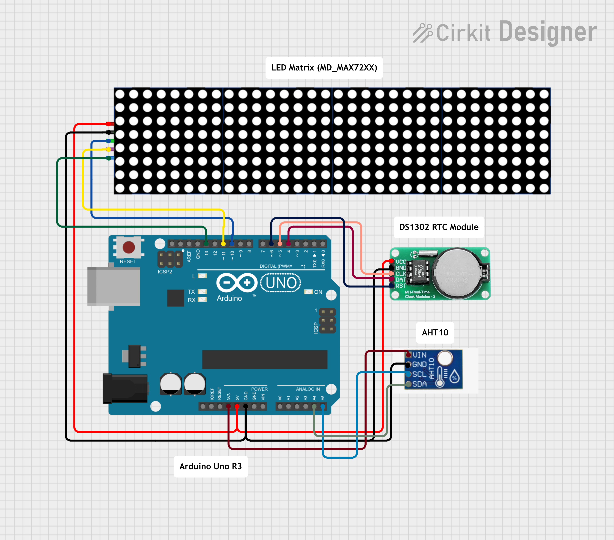

# Arduino Uno R3 Digital Clock

This project displays **time**, **day**, **date**, **temperature**, **humidity**, and **greeting messages** on a 4x MAX7219 LED matrix using **Arduino Uno**, **DS1302 RTC**, and **Adafruit AHT10 sensor**. It includes smooth page transitions, scrolling greetings.

---

## Video Demonstration
Watch the live demo here:  
[ Video Demonstration](https://vt.tiktok.com/ZSPJsF9co/)  

## Features

- Displays **time** in 12-hour format with AM/PM.
- Shows **day of the week**, **month**, and **date**.
- Displays **temperature (°C)** and **humidity (%)**.
- Shows greetings based on time:
  - 5:00 AM – 10:00 AM → "GOOD MORNING"
  - 12:00 PM – 2:00 PM → "GOOD AFTERNOON"
  - 6:00 PM – 8:00 PM → "GOOD EVENING"
- Smooth **fade-in/fade-out** animations for page transitions.
- **Auto-restart at 3:00 AM** for system refresh using watchdog timer.
- Easy to customize display duration, greeting times, and LED intensity.

---

## Disclaimer

This project is for educational and experimental purposes only. The creator is not responsible for any damage, injury, or loss caused by using this project. Always handle electronics safely and operate the device in a controlled environment.

---
## Screenshot

---

## Pin Connections

### MAX7219 LED Matrix (4x)
| MAX7219 Pin | Arduino Uno Pin |
|------------|----------------|
| VCC        | 5V             |
| GND        | GND            |
| DIN        | 11 (MOSI)      |
| CS         | 10             |
| CLK        | 13 (SCK)       |

### DS1302 RTC
| DS1302 Pin | Arduino Uno Pin |
|------------|----------------|
| DAT        | 4              |
| CLK        | 5              |
| RST        | 6              |
| VCC        | 5V             |
| GND        | GND            |

### AHT10 Sensor (I2C)
| Sensor Pin | Arduino Uno Pin |
|------------|----------------|
| VCC        | 3.3V / 5V      |
| GND        | GND            |
| SDA        | A4             |
| SCL        | A5             |

---

## Author

- Created with passion ❤ by **Roy Cuadra** 
- Updated Date: 12-08-2025

---

**Thank you for checking out this project!** 
You are welcome to **fork**, **improve**, or **use** it for learning purposes.
